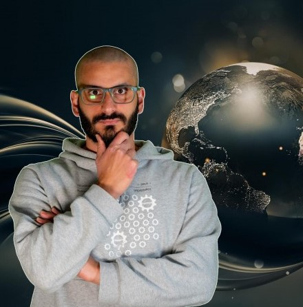
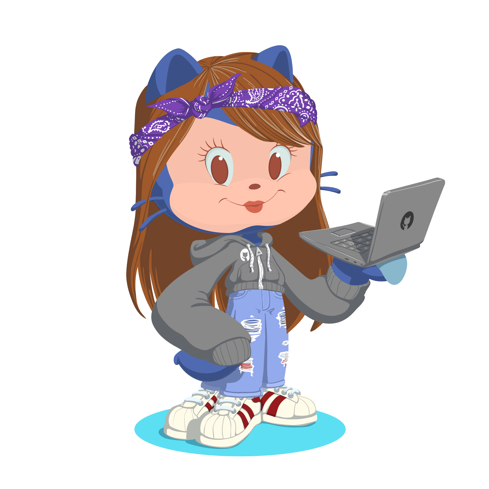
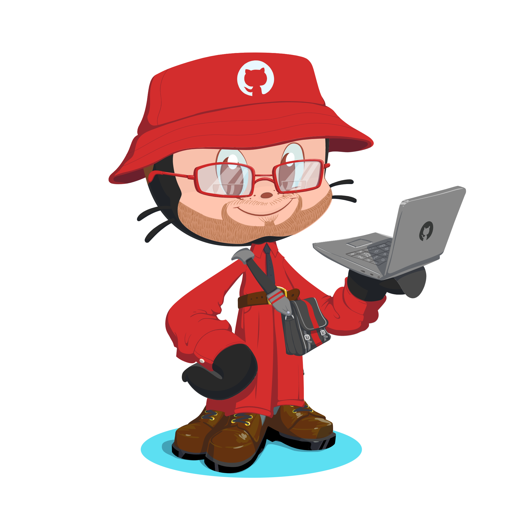

# EddieHub

Here, right now on **your** screens, you are in the presence of the most inclusive *Open Source* community on the planet!

> Want to join the community? Open an issue [Here](https://github.com/EddieHubCommunity/support/issues/new?assignees=&labels=invite+me+to+the+organisation&template=invitation.yml&title=Please+invite+me+to+the+GitHub+Community+Organization)!

## Meet a few members...

| Member | Photo | Role |
| ------ | ---- | ----- |
| Hubber |  | The Mascot! |
| Chibi  |  | Discord bot! |
| Eddie  |  | Founder of EddieHub! |

This organisation is the home of *open source*! Make Pull Requests, open Issues, share ideas, help each other, fix problems! 

## This is a place welcome to all!

 

